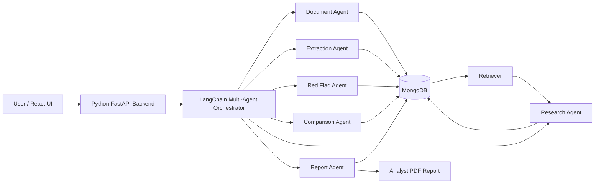
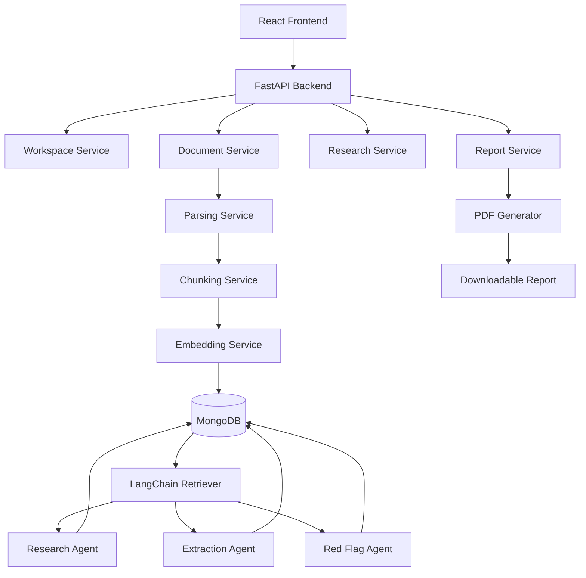
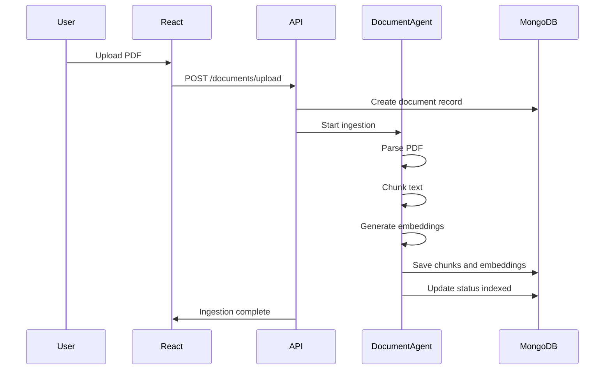
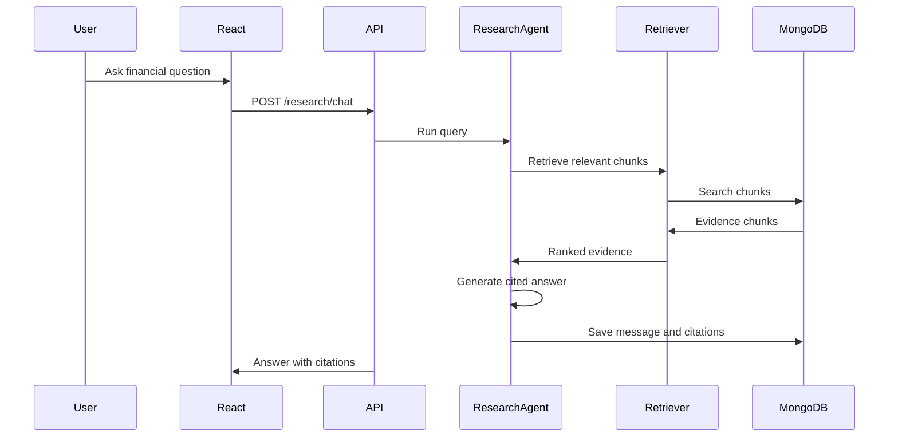

# FinSightAI: Multi-Agent Financial Research System

## Current Implementation Status

This codebase is now a runnable MVP of the product described below. It includes:

- FastAPI backend with MongoDB repositories and API routes.
- React/Vite frontend with workspace creation, upload, cited research, comparison, and report workflows.
- PDF parsing with page-preserving chunks.
- Deterministic local embeddings and cosine retrieval for keyless MVP use.
- Rule-based financial metric extraction with source page/chunk evidence.
- Rule-based red-flag detection with cited evidence.
- PDF report generation with extracted metrics and risk indicators.

It does **not** fully meet the complete vision yet. The remaining production gaps are LangChain/LLM answer synthesis, richer table extraction, audited financial metric normalization across every filing format, chat history persistence, advanced evaluation, and production auth/security.

## Precise Run Instructions

### Option A: Docker Compose

Prerequisites: Docker Desktop, free ports `27017`, `8000`, and `5173`.

```powershell
# Navigate to the project root directory
cd path/to/FinSightAI_Project_Skeleton

copy .env.example .env
docker compose up --build
```

Open:

- Frontend: http://localhost:5173
- Backend health: http://localhost:8000/health
- API docs: http://localhost:8000/docs

### Option B: Local Development

Start MongoDB:

```powershell
docker run --name finsight-mongo -p 27017:27017 -d mongo:7
```

Start backend:

```powershell
# From the project root, navigate to the backend directory
cd backend
python -m venv .venv
.\.venv\Scripts\python.exe -m pip install -r requirements.txt
.\.venv\Scripts\uvicorn.exe app.main:app --reload --host 0.0.0.0 --port 8000
```

Start frontend:

```powershell
# From the project root, navigate to the frontend directory
cd frontend
npm install
npm run dev
```

### First Demo Workflow

1. Create a workspace on the dashboard.
2. Upload a PDF and keep auto-ingestion enabled.
3. Ask a research question using the active workspace.
4. Run company comparison after uploading one or more company documents.
5. Generate a report from the Reports page.


### Troubleshooting

If pip times out while downloading packages, rerun with a longer timeout:

```powershell
.\.venv\Scripts\python.exe -m pip install --timeout 120 --retries 10 -r requirements.txt
```

If MongoDB already exists locally:

```powershell
docker start finsight-mongo
```

If the frontend says `API offline`, confirm the backend is running at http://localhost:8000/health.

### Optional AI Dependencies

Install optional LangChain/data-science packages only when extending the deterministic MVP into the fuller AI architecture:

```powershell
cd backend
.\.venv\Scripts\python.exe -m pip install -r requirements-ai.txt
```

---
> **A source-grounded, multi-agent finance research copilot that reads annual reports, filings and financial statements, extracts key metrics, detects red flags, compares companies, answers cited research questions and generates analyst-style PDF reports.**

---

## 1. Project Overview

**FinSightAI** is a full-stack AI research platform for finance students, MBA candidates, early-career analysts and research teams who need to understand long company documents quickly and accurately.

The system accepts annual reports, 10-K/10-Q filings, earnings transcripts and financial statements. After upload, a **multi-agent pipeline** is triggered automatically:

1. **Document Agent** parses, chunks, embeds and indexes the uploaded document.
2. **Extraction Agent** extracts financial metrics, ratios and key performance indicators.
3. **Red Flag Agent** detects risks, anomalies and unusual financial patterns.
4. **Comparison Agent** compares companies across uploaded documents.
5. **Research Agent** answers user questions with multi-step retrieval and exact citations.
6. **Report Agent** compiles insights into an analyst-style PDF report.

The core principle is **strict source grounding**: every extracted metric, risk statement, comparison and research answer must be traceable to the original uploaded source document. The system should refuse or mark uncertainty when a claim is not supported by the documents.

---

## 2. Problem Being Solved

Finance learners and analysts spend significant time reading lengthy reports and filings. Manual review is difficult because:

- financial documents are long, dense and inconsistent in format;
- key metrics may appear across tables, notes, MD&A sections and footnotes;
- risks and red flags are scattered across multiple sections;
- comparing companies requires normalising metrics across different reports;
- LLM answers can hallucinate if they are not grounded in source documents;
- creating a clean analyst-style report manually takes hours.

FinSightAI solves this by combining **RAG, multi-agent AI, structured extraction, document citations, MongoDB-backed persistence and a React research workspace**.

---

## 3. Tech Stack

### Core Stack Required

| Layer | Technology | Purpose |
|---|---|---|
| Backend / AI | Python | API layer, document processing, agents, extraction, report generation |
| Frontend | React | Research workspace, upload UI, chat interface, dashboards, report builder |
| Database | MongoDB | Workspaces, documents, chunks, embeddings, metrics, red flags, chat history, reports |
| AI Framework | LangChain | RAG, tools, retrievers, agent chains, prompt templates, orchestration |

### Recommended Supporting Stack

| Category | Tools |
|---|---|
| API server | FastAPI, Uvicorn, Pydantic |
| PDF parsing | PyMuPDF, pdfplumber, Unstructured, Camelot/Tabula optional for tables |
| Data processing | Pandas, NumPy, regex, dateparser |
| Embeddings | OpenAI, Hugging Face, SentenceTransformers, or any approved embedding model |
| Vector retrieval | MongoDB stored vectors + cosine search for MVP; MongoDB Atlas Vector Search or FAISS optional |
| Report generation | Jinja2 + WeasyPrint/ReportLab |
| Frontend state | React Query, Zustand or Redux Toolkit |
| UI | Tailwind CSS, shadcn/ui optional, Recharts for charts |
| Testing | Pytest, React Testing Library, Playwright optional |
| DevOps | Docker Compose, Makefile, GitHub Actions optional |

---

## 4. Product Vision

### One-line vision

**Turn raw company documents into cited analyst intelligence through coordinated AI agents.**

### User value

A user should be able to upload company documents and ask:

- “Summarize revenue, profit and margin trends for the last three years.”
- “What are the major red flags in this annual report?”
- “Compare Company A and Company B on revenue growth, debt, profitability and risks.”
- “Generate a 5-page analyst-style report with citations.”

The system should answer with:

- exact source citations;
- extracted financial tables;
- confidence scores;
- red flag explanations;
- peer comparison charts;
- downloadable PDF reports.

---

## 5. Key Features

### 5.1 Research Workspace

- Create named research workspaces.
- Upload multiple company documents per workspace.
- Track ingestion and agent execution status.
- Store chat sessions, extracted metrics, red flags and generated reports.

### 5.2 Document Upload and Parsing

- Upload PDF documents.
- Extract text, tables and metadata.
- Preserve page numbers and section references.
- Chunk text using finance-aware chunking.
- Generate embeddings for each chunk.
- Store chunks and embeddings in MongoDB.

### 5.3 Automated Financial Metric Extraction

- Extract revenue, EBITDA, net income, gross margin, operating margin, debt, cash, EPS, capex and other KPIs.
- Normalize values across units such as thousands, millions and crores.
- Store extracted metrics with source references.
- Display extracted metrics in a table with citations.

### 5.4 Red Flag Detection

- Detect rising debt.
- Detect falling margins.
- Detect negative cash flow trends.
- Detect auditor qualifications.
- Detect contingent liabilities and legal risk.
- Detect going-concern language.
- Detect revenue concentration or customer concentration risk.
- Detect unusual related-party transactions.

### 5.5 Multi-document Company Comparison

- Compare companies within the same workspace.
- Normalize metrics by fiscal year and unit.
- Generate side-by-side tables.
- Compare revenue growth, profitability, leverage, liquidity, cash generation and risks.
- Show citation-backed comparison notes.

### 5.6 Conversational Research Agent

- Ask multi-part financial questions.
- Retrieve relevant chunks from indexed documents.
- Reason step-by-step internally, but return concise user-facing answers.
- Attach exact source citations to every factual answer.
- Refuse unsupported claims.

### 5.7 Analyst-style PDF Report

Generate a report containing:

1. Executive Summary
2. Company Overview
3. Key Financials
4. Revenue and Profitability Trends
5. Liquidity and Leverage
6. Red Flags and Risk Indicators
7. Peer Comparison
8. Analyst Notes
9. Source Citation Appendix

---

## 6. Agent Architecture



---

## 7. Agent Responsibilities

### 7.1 Document Agent

**Purpose:** Convert uploaded documents into searchable, citable knowledge units.

Responsibilities:

- validate uploaded file type and size;
- extract text and tables;
- detect document metadata such as company name, fiscal year and report type;
- chunk document into semantically meaningful sections;
- generate embeddings;
- store chunks, metadata and embeddings;
- mark document ingestion status.

Input:

```json
{
  "workspace_id": "ws_123",
  "document_id": "doc_456",
  "file_path": "storage/raw/company_annual_report.pdf"
}
```

Output:

```json
{
  "document_id": "doc_456",
  "status": "indexed",
  "pages_processed": 182,
  "chunks_created": 742,
  "tables_extracted": 38
}
```

### 7.2 Extraction Agent

**Purpose:** Extract key metrics and ratios from indexed documents.

Responsibilities:

- retrieve finance-relevant chunks;
- identify financial tables and narrative KPI statements;
- extract metrics with period, unit, currency and source citation;
- normalize metrics;
- store structured financial metrics.

Example output:

```json
{
  "company": "Example Ltd",
  "metric": "Revenue",
  "value": 12500,
  "unit": "INR crore",
  "period": "FY2024",
  "source": {
    "document_id": "doc_456",
    "page": 42,
    "chunk_id": "chunk_789"
  },
  "confidence": 0.91
}
```

### 7.3 Red Flag Agent

**Purpose:** Detect risks and anomalies without user prompting.

Responsibilities:

- scan indexed documents and extracted metrics;
- identify quantitative risks such as rising debt or falling margins;
- identify qualitative risks such as auditor qualifications or legal proceedings;
- classify severity as low, medium or high;
- attach exact source citation and explanation.

Red flag categories:

- leverage risk;
- liquidity risk;
- profitability deterioration;
- cash-flow stress;
- auditor concern;
- legal/regulatory risk;
- related-party transaction risk;
- customer concentration risk;
- revenue recognition risk;
- inventory or receivable build-up risk.

### 7.4 Comparison Agent

**Purpose:** Benchmark multiple companies using normalized extracted metrics.

Responsibilities:

- select comparable documents from a workspace;
- normalize fiscal periods and units;
- compute comparison tables;
- generate peer analysis;
- identify strengths and weaknesses;
- cite every comparison value.

### 7.5 Research Agent

**Purpose:** Answer user questions using RAG and citations.

Responsibilities:

- understand user question;
- decompose multi-part research questions;
- retrieve relevant chunks;
- rerank evidence;
- generate answer only from retrieved sources;
- include citations;
- show uncertainty when evidence is insufficient.

Answer policy:

- do not invent numbers;
- do not assume missing fiscal periods;
- cite each factual claim;
- answer “not found in uploaded documents” when evidence is missing.

### 7.6 Report Agent

**Purpose:** Compile all agent outputs into a PDF report.

Responsibilities:

- pull extracted metrics, red flags, comparison results and research notes;
- generate report sections;
- build charts and tables;
- generate citation appendix;
- export PDF.

---

## 8. Standard Repository Structure

```text
finsight-ai/
├── README.md
├── .env.example
├── .gitignore
├── docker-compose.yml
├── Makefile
├── backend/
│   ├── README.md
│   ├── requirements.txt
│   ├── pyproject.toml
│   ├── app/
│   │   ├── main.py
│   │   ├── core/
│   │   │   ├── config.py
│   │   │   ├── logging.py
│   │   │   └── errors.py
│   │   ├── db/
│   │   │   ├── mongo.py
│   │   │   └── indexes.py
│   │   ├── api/
│   │   │   └── v1/
│   │   │       ├── router.py
│   │   │       └── routes/
│   │   │           ├── workspaces.py
│   │   │           ├── documents.py
│   │   │           ├── agents.py
│   │   │           ├── research.py
│   │   │           ├── comparison.py
│   │   │           └── reports.py
│   │   ├── schemas/
│   │   │   ├── workspace.py
│   │   │   ├── document.py
│   │   │   ├── chunk.py
│   │   │   ├── metric.py
│   │   │   ├── red_flag.py
│   │   │   ├── research.py
│   │   │   └── report.py
│   │   ├── repositories/
│   │   │   ├── base.py
│   │   │   ├── workspace_repository.py
│   │   │   ├── document_repository.py
│   │   │   ├── chunk_repository.py
│   │   │   ├── metric_repository.py
│   │   │   └── report_repository.py
│   │   ├── services/
│   │   │   ├── document_service.py
│   │   │   ├── parsing_service.py
│   │   │   ├── chunking_service.py
│   │   │   ├── embedding_service.py
│   │   │   ├── retrieval_service.py
│   │   │   ├── citation_service.py
│   │   │   ├── pdf_report_service.py
│   │   │   └── evaluation_service.py
│   │   ├── agents/
│   │   │   ├── base_agent.py
│   │   │   ├── document_agent.py
│   │   │   ├── extraction_agent.py
│   │   │   ├── red_flag_agent.py
│   │   │   ├── comparison_agent.py
│   │   │   ├── research_agent.py
│   │   │   └── report_agent.py
│   │   ├── orchestration/
│   │   │   ├── workflow.py
│   │   │   ├── states.py
│   │   │   └── events.py
│   │   ├── prompts/
│   │   │   ├── extraction_prompt.md
│   │   │   ├── red_flag_prompt.md
│   │   │   ├── research_prompt.md
│   │   │   └── report_prompt.md
│   │   ├── utils/
│   │   │   ├── ids.py
│   │   │   ├── files.py
│   │   │   ├── finance_units.py
│   │   │   └── text_cleaning.py
│   │   └── tests/
│   │       ├── test_chunking.py
│   │       ├── test_citations.py
│   │       ├── test_extraction_agent.py
│   │       └── test_research_agent.py
│   └── storage/
│       ├── raw/
│       ├── parsed/
│       └── reports/
├── frontend/
│   ├── README.md
│   ├── package.json
│   ├── vite.config.ts
│   ├── index.html
│   └── src/
│       ├── main.tsx
│       ├── App.tsx
│       ├── api/
│       │   ├── client.ts
│       │   ├── workspaces.ts
│       │   ├── documents.ts
│       │   ├── research.ts
│       │   └── reports.ts
│       ├── components/
│       │   ├── layout/
│       │   ├── upload/
│       │   ├── chat/
│       │   ├── citations/
│       │   ├── metrics/
│       │   ├── redflags/
│       │   └── reports/
│       ├── pages/
│       │   ├── Dashboard.tsx
│       │   ├── Workspace.tsx
│       │   ├── DocumentUpload.tsx
│       │   ├── ResearchChat.tsx
│       │   ├── Comparison.tsx
│       │   └── ReportBuilder.tsx
│       ├── store/
│       │   └── workspaceStore.ts
│       ├── types/
│       │   ├── document.ts
│       │   ├── metric.ts
│       │   ├── redFlag.ts
│       │   └── report.ts
│       └── styles/
│           └── globals.css
├── docs/
│   ├── architecture.md
│   ├── api_contract.md
│   ├── data_model.md
│   ├── agent_design.md
│   ├── evaluation_plan.md
│   └── demo_script.md
├── scripts/
│   ├── seed_demo_documents.py
│   ├── reindex_workspace.py
│   └── generate_sample_report.py
└── sample_data/
    └── README.md
```

---

## 9. Design Patterns Used

### 9.1 Agent Pattern

Each agent has one responsibility and a standard interface:

```python
class BaseAgent:
    name: str
    description: str

    async def run(self, state: AgentState) -> AgentResult:
        raise NotImplementedError
```

Benefits:

- easy to test each agent independently;
- easy to add new agents later;
- avoids one giant prompt doing everything.

### 9.2 Orchestrator Pattern

The orchestrator controls the workflow:

```text
Upload Document
    ↓
Document Agent
    ↓
Extraction Agent
    ↓
Red Flag Agent
    ↓
Comparison Agent, if multiple companies exist
    ↓
Research Agent, on user query
    ↓
Report Agent, on report request
```

Benefits:

- predictable execution;
- better debugging;
- agent outputs can be cached;
- failed agents can be retried.

### 9.3 Repository Pattern

Database logic is separated from business logic.

Example:

```python
class DocumentRepository:
    async def create(self, payload: dict) -> dict: ...
    async def get_by_id(self, document_id: str) -> dict | None: ...
    async def update_status(self, document_id: str, status: str) -> None: ...
```

Benefits:

- cleaner services;
- easier MongoDB query changes;
- easier unit testing.

### 9.4 Service Layer Pattern

Services perform business logic:

- `DocumentService`
- `ParsingService`
- `ChunkingService`
- `EmbeddingService`
- `RetrievalService`
- `CitationService`
- `PDFReportService`

Benefits:

- API routes stay thin;
- agents reuse common services;
- business logic is not duplicated.

### 9.5 Strategy Pattern

Different parsers can be plugged in:

```text
PDFParserStrategy
TableParserStrategy
TranscriptParserStrategy
AnnualReportParserStrategy
```

Benefits:

- one interface for multiple document types;
- easier extension for 10-K, annual report, earnings transcript.

### 9.6 Guardrail Pattern

All model outputs are validated before saving or showing.

Guardrails:

- every metric must have a source citation;
- every answer must cite source chunks;
- unsupported claims must be marked as insufficient evidence;
- numeric extraction must pass schema validation;
- generated reports must include citation appendix.

---

## 10. System Architecture



---

## 11. Data Flow

### 11.1 Document Upload Flow



### 11.2 Research Query Flow



---

## 12. MongoDB Data Model

### 12.1 `workspaces`

```json
{
  "_id": "ws_123",
  "name": "Indian IT Companies FY2024",
  "description": "Comparison of Infosys, TCS and Wipro",
  "created_at": "2026-01-01T10:00:00Z",
  "updated_at": "2026-01-01T10:00:00Z"
}
```

### 12.2 `documents`

```json
{
  "_id": "doc_456",
  "workspace_id": "ws_123",
  "company_name": "Example Ltd",
  "document_type": "annual_report",
  "fiscal_year": "FY2024",
  "file_name": "example_annual_report_2024.pdf",
  "file_path": "storage/raw/example_annual_report_2024.pdf",
  "status": "indexed",
  "pages": 182,
  "created_at": "2026-01-01T10:05:00Z"
}
```

### 12.3 `chunks`

```json
{
  "_id": "chunk_789",
  "workspace_id": "ws_123",
  "document_id": "doc_456",
  "page_start": 42,
  "page_end": 43,
  "section_title": "Management Discussion and Analysis",
  "text": "Revenue increased by ...",
  "embedding": [0.012, -0.034, 0.056],
  "token_count": 612
}
```

### 12.4 `financial_metrics`

```json
{
  "_id": "metric_001",
  "workspace_id": "ws_123",
  "document_id": "doc_456",
  "company_name": "Example Ltd",
  "metric_name": "Revenue",
  "value": 12500,
  "unit": "INR crore",
  "period": "FY2024",
  "source_chunk_id": "chunk_789",
  "source_page": 42,
  "confidence": 0.91,
  "created_by_agent": "ExtractionAgent"
}
```

### 12.5 `red_flags`

```json
{
  "_id": "flag_001",
  "workspace_id": "ws_123",
  "document_id": "doc_456",
  "company_name": "Example Ltd",
  "category": "Leverage Risk",
  "severity": "High",
  "title": "Debt increased significantly year-over-year",
  "explanation": "The company reported a sharp increase in borrowings compared with the previous year.",
  "source_chunk_id": "chunk_900",
  "source_page": 88,
  "confidence": 0.86,
  "created_by_agent": "RedFlagAgent"
}
```

### 12.6 `research_messages`

```json
{
  "_id": "msg_001",
  "workspace_id": "ws_123",
  "session_id": "session_001",
  "role": "assistant",
  "question": "What were the main profitability risks?",
  "answer": "The main profitability risks were margin compression and higher finance costs...",
  "citations": [
    {
      "document_id": "doc_456",
      "page": 51,
      "chunk_id": "chunk_222"
    }
  ],
  "created_at": "2026-01-01T11:00:00Z"
}
```

### 12.7 `reports`

```json
{
  "_id": "report_001",
  "workspace_id": "ws_123",
  "title": "Analyst Report: Example Ltd FY2024",
  "status": "generated",
  "file_path": "storage/reports/report_001.pdf",
  "sections": ["Executive Summary", "Key Financials", "Red Flags", "Comparison"],
  "created_at": "2026-01-01T12:00:00Z"
}
```

---

## 13. API Contract

### Workspace APIs

| Method | Endpoint | Purpose |
|---|---|---|
| POST | `/api/v1/workspaces` | Create workspace |
| GET | `/api/v1/workspaces` | List workspaces |
| GET | `/api/v1/workspaces/{workspace_id}` | Get workspace details |
| DELETE | `/api/v1/workspaces/{workspace_id}` | Delete workspace |

### Document APIs

| Method | Endpoint | Purpose |
|---|---|---|
| POST | `/api/v1/documents/upload` | Upload PDF document |
| POST | `/api/v1/documents/{document_id}/ingest` | Start ingestion pipeline |
| GET | `/api/v1/documents/{document_id}` | Get document metadata |
| GET | `/api/v1/documents/{document_id}/chunks` | View chunks and citations |
| DELETE | `/api/v1/documents/{document_id}` | Delete document |

### Agent APIs

| Method | Endpoint | Purpose |
|---|---|---|
| POST | `/api/v1/agents/run/document` | Run Document Agent |
| POST | `/api/v1/agents/run/extraction` | Run Extraction Agent |
| POST | `/api/v1/agents/run/red-flags` | Run Red Flag Agent |
| GET | `/api/v1/agents/runs/{run_id}` | Get agent run status |

### Research APIs

| Method | Endpoint | Purpose |
|---|---|---|
| POST | `/api/v1/research/chat` | Ask cited research question |
| GET | `/api/v1/research/sessions/{session_id}` | Load chat history |

### Comparison APIs

| Method | Endpoint | Purpose |
|---|---|---|
| POST | `/api/v1/comparison/run` | Run peer comparison |
| GET | `/api/v1/comparison/{workspace_id}` | Get comparison results |

### Report APIs

| Method | Endpoint | Purpose |
|---|---|---|
| POST | `/api/v1/reports/generate` | Generate analyst PDF |
| GET | `/api/v1/reports/{report_id}` | Get report metadata |
| GET | `/api/v1/reports/{report_id}/download` | Download PDF report |

---

## 14. Frontend Pages

### 14.1 Dashboard

Purpose:

- show all workspaces;
- create new workspace;
- show document count, report count and last activity.

### 14.2 Workspace Page

Purpose:

- show uploaded companies/documents;
- display ingestion status;
- show extracted metrics summary;
- show red flag summary;
- open chat and report builder.

### 14.3 Document Upload Page

Purpose:

- drag-and-drop PDF upload;
- preview file metadata;
- select company name, fiscal year and document type;
- start ingestion;
- show live ingestion status.

### 14.4 Research Chat Page

Purpose:

- ask financial questions;
- show cited answers;
- show source documents and page numbers;
- allow evidence inspection.

### 14.5 Comparison Page

Purpose:

- compare selected companies;
- show metrics table;
- show charts;
- show risk comparison;
- cite every comparison.

### 14.6 Report Builder Page

Purpose:

- select report sections;
- preview generated report;
- download PDF.

---

## 15. Implementation Flow

### Phase 1: Foundation

Deliverables:

- repository setup;
- backend FastAPI app;
- MongoDB connection;
- React frontend shell;
- workspace CRUD;
- document upload endpoint;
- basic dashboard.

Acceptance checklist:

- user can create workspace;
- user can upload PDF;
- document metadata is stored in MongoDB;
- frontend can show uploaded document.

### Phase 2: Document Agent

Deliverables:

- PDF text extraction;
- page-level text preservation;
- finance-aware chunking;
- embedding generation;
- chunk storage in MongoDB;
- ingestion status UI.

Acceptance checklist:

- PDF is parsed page-wise;
- chunks are stored with page numbers;
- embeddings are generated;
- document status changes from uploaded to indexed.

### Phase 3: Extraction Agent

Deliverables:

- metric extraction prompt;
- schema validation;
- metric normalization;
- citation attachment;
- extracted metrics table UI.

Acceptance checklist:

- key metrics are extracted;
- each metric has value, unit, period and source page;
- frontend shows extracted metrics with citations.

### Phase 4: Red Flag Agent

Deliverables:

- red flag taxonomy;
- risk detection prompt;
- severity scoring;
- red flag dashboard;
- citation-backed explanations.

Acceptance checklist:

- red flags are generated automatically after ingestion;
- each red flag has severity and citation;
- user can inspect source evidence.

### Phase 5: Research Agent

Deliverables:

- RAG retrieval;
- multi-step query decomposition;
- cited answer generation;
- chat interface;
- unsupported claim handling.

Acceptance checklist:

- user can ask document questions;
- answer includes citations;
- system refuses unsupported questions.

### Phase 6: Comparison Agent

Deliverables:

- multi-company selection;
- metric normalization;
- benchmark tables;
- comparison narrative;
- citation-backed peer analysis.

Acceptance checklist:

- user can compare at least two companies;
- comparison table is generated;
- every metric has a source.

### Phase 7: Report Agent

Deliverables:

- report template;
- PDF generation;
- charts and tables;
- citation appendix;
- download endpoint.

Acceptance checklist:

- user can generate a PDF report;
- report contains executive summary, key financials, red flags, comparison and citations.

### Phase 8: Testing and Demo Readiness

Deliverables:

- unit tests;
- sample documents;
- demo script;
- screenshots;
- deployment instructions;
- final documentation.

Acceptance checklist:

- complete end-to-end demo works;
- citation accuracy verified;
- README is complete;
- demo video can be recorded.

---

## 16. LangChain Design

### 16.1 Tools

Recommended tools exposed to agents:

```text
retrieve_chunks(workspace_id, query, filters)
get_document_metadata(document_id)
extract_financial_table(document_id, page_range)
save_metric(metric_payload)
save_red_flag(red_flag_payload)
get_metrics_for_company(company_name)
compare_metrics(company_ids, metrics)
generate_pdf_report(report_payload)
```

### 16.2 Retriever

Retriever logic:

1. Build query from user question or agent task.
2. Apply workspace and document filters.
3. Retrieve top-k chunks from MongoDB vector store or Python cosine search.
4. Rerank chunks using keyword overlap and metadata relevance.
5. Return evidence chunks with citation metadata.

### 16.3 Prompt Guardrails

Every agent prompt should include:

- use only supplied context;
- do not invent financial values;
- cite every metric and factual claim;
- return JSON matching schema;
- include confidence score;
- mark unsupported fields as `null` or `insufficient_evidence`.

---

## 17. Example Prompt Contracts

### Extraction Agent Prompt Contract

```text
You are the Extraction Agent for a financial research system.
Your task is to extract financial metrics only from the provided source chunks.
Do not use external knowledge.
Do not infer values that are not present.
Every metric must include metric_name, value, unit, period, source_page, source_chunk_id and confidence.
Return valid JSON only.
```

### Red Flag Agent Prompt Contract

```text
You are the Red Flag Agent.
Identify financial risks, anomalies and warning signs from the provided document evidence and extracted metrics.
Every red flag must include category, severity, title, explanation, source_page, source_chunk_id and confidence.
If evidence is insufficient, return an empty list.
```

### Research Agent Prompt Contract

```text
You are the Research Agent.
Answer the user question only using retrieved source chunks.
Every factual claim must include citation markers.
If the answer is not present in the documents, say that the uploaded documents do not provide enough evidence.
```

---

## 18. Citation Policy

A citation should contain:

```json
{
  "document_id": "doc_456",
  "document_name": "Example Annual Report 2024.pdf",
  "page": 42,
  "chunk_id": "chunk_789",
  "snippet": "Revenue increased by ..."
}
```

Rules:

- no answer without evidence;
- no metric without page number;
- no red flag without source snippet;
- citations must be visible in UI;
- report must include source appendix.

---

## 19. Evaluation Plan

### 19.1 Extraction Accuracy

Measure:

- number of correctly extracted metrics;
- value accuracy;
- unit accuracy;
- period accuracy;
- source citation accuracy.

Target for MVP:

- at least 80% correct extraction on seeded documents;
- 100% of saved metrics must have citations.

### 19.2 Red Flag Quality

Measure:

- relevance of red flags;
- false positives;
- severity correctness;
- explanation quality;
- source faithfulness.

Target for MVP:

- at least 5 meaningful red flag categories;
- each red flag must include explanation and citation.

### 19.3 Research Agent Effectiveness

Measure:

- answer relevance;
- citation accuracy;
- ability to answer multi-part questions;
- refusal behavior when evidence is missing.

Target for MVP:

- 90% of research answers include citations;
- unsupported questions are not hallucinated.

### 19.4 Report Completeness

Measure:

- report sections generated;
- tables and charts included;
- citation appendix included;
- PDF download works.

Target for MVP:

- one complete analyst-style PDF generated from seed documents.

### 19.5 System Cohesion

Measure:

- smooth agent orchestration;
- stable backend API;
- clear UI flow;
- documented setup and demo.

---

## 20. Milestone Plan

### Week 1-2: Architecture and Document Agent

- study annual report, 10-K and earnings transcript structure;
- finalize architecture and data models;
- implement workspace/session management;
- build PDF upload;
- implement parsing, chunking and embedding;
- index 3-4 seed company documents.

### Week 3-4: Extraction and Red Flag Agents

- build Extraction Agent;
- build Red Flag Agent;
- implement orchestration after document upload;
- store agent outputs;
- validate source faithfulness.

### Week 5-6: Research and Comparison Agents

- build Research Agent with cited RAG;
- build Comparison Agent;
- implement chat interface;
- show side-by-side company comparison;
- start report template.

### Week 7-8: Report, Testing and Final Demo

- complete Report Agent;
- generate PDF report;
- test citation accuracy and extraction correctness;
- improve prompts and retrieval;
- prepare project documentation and final demonstration.

---

## 21. Setup Instructions

### 21.1 Prerequisites

- Python 3.10+
- Node.js 18+
- MongoDB local or cloud instance
- Optional: Docker and Docker Compose

### 21.2 Environment Variables

Create a `.env` file using `.env.example`:

```env
APP_NAME=FinSightAI
ENV=development
API_HOST=0.0.0.0
API_PORT=8000
MONGO_URI=mongodb://localhost:27017
MONGO_DB=finsight_ai
LLM_PROVIDER=openai_or_local
LLM_API_KEY=replace_me
EMBEDDING_MODEL=text-embedding-model
UPLOAD_DIR=backend/storage/raw
REPORT_DIR=backend/storage/reports
CORS_ORIGINS=http://localhost:5173
```

### 21.3 Run Backend

```bash
cd backend
python -m venv .venv
source .venv/bin/activate
pip install -r requirements.txt
uvicorn app.main:app --reload --port 8000
```

### 21.4 Run Frontend

```bash
cd frontend
npm install
npm run dev
```

### 21.5 Run with Docker Compose

```bash
docker compose up --build
```

---

## 22. Demo Flow

Use this exact flow for presentation:

1. Open dashboard.
2. Create workspace: “FY2024 IT Services Analysis”.
3. Upload 2-3 company annual reports.
4. Show ingestion status changing from uploaded to indexed.
5. Open extracted metrics table.
6. Show red flag cards with severity and citations.
7. Ask Research Agent: “What are the key profitability risks?”
8. Show cited answer and source page references.
9. Open Comparison page and compare two companies.
10. Generate analyst-style PDF report.
11. Download report and show citation appendix.

---

## 23. Selection-Focused Differentiators

### 23.1 Not a Simple Chatbot

This system is not just a PDF chatbot. It has specialized agents for document ingestion, metric extraction, red flag detection, comparison, research and report generation.

### 23.2 Strict Source Grounding

Every answer, metric and risk statement is backed by uploaded documents. The system does not generate unsupported financial claims.

### 23.3 Analyst Workflow Automation

The product follows a real analyst workflow: read documents, extract metrics, find risks, compare companies, ask questions and prepare report.

### 23.4 Structured Outputs

The system saves metrics, red flags and reports as structured records, not only chat text.

### 23.5 End-to-End Product Thinking

The repo includes backend, frontend, database schema, agent design, report generation, evaluation plan, demo flow and deployment setup.

---

## 24. Risk Management

| Risk | Mitigation |
|---|---|
| PDF parsing fails on complex annual reports | Use multiple parsers and fallback extraction |
| LLM hallucination | Enforce source-only prompts and citation validation |
| Wrong metric extraction | Schema validation + confidence + manual review UI |
| Slow retrieval | Index chunks by workspace, document, company and fiscal year |
| Poor table extraction | Start with text-based extraction; add Camelot/Tabula as enhancement |
| Frontend complexity | Build MVP screens first: upload, metrics, red flags, chat, report |
| Vector search unavailable locally | Store embeddings in MongoDB and compute cosine similarity in Python for MVP |

---

## 25. Testing Strategy

### Backend Tests

- PDF parsing test
- chunking test
- citation preservation test
- embedding service test
- retrieval test
- metric schema validation test
- red flag schema validation test
- report generation test

### Frontend Tests

- workspace creation UI
- file upload UI
- chat message rendering
- citation card rendering
- report download button

### Agent Tests

- Extraction Agent returns valid JSON
- Red Flag Agent returns cited risks
- Research Agent refuses unsupported questions
- Report Agent includes required sections

---

## 26. MVP Scope

A strong MVP should include:

- workspace creation;
- upload 2-3 PDF reports;
- parse and chunk documents;
- store chunks and embeddings;
- extract 8-12 key metrics;
- detect at least 5 red flag categories;
- answer cited research questions;
- compare at least 2 companies;
- generate PDF report.

---

## 27. Future Enhancements

- support Excel financial statements;
- support earnings call transcript analysis;
- add financial chart generation;
- add human review and correction loop;
- add audit logs for every agent decision;
- add role-based access control;
- add advanced table extraction;
- add sector-specific metric templates;
- add local LLM deployment for private enterprise data;
- add MongoDB Atlas Vector Search or dedicated vector database for scale.

---

## 28. Final Submission Checklist

- [ ] GitHub repo has clean README.
- [ ] Backend runs locally.
- [ ] Frontend runs locally.
- [ ] MongoDB connection works.
- [ ] At least 3 seed documents can be ingested.
- [ ] Document Agent works.
- [ ] Extraction Agent works.
- [ ] Red Flag Agent works.
- [ ] Research Agent returns cited answers.
- [ ] Comparison Agent compares companies.
- [ ] Report Agent exports PDF.
- [ ] Screenshots added to README.
- [ ] Demo video recorded.
- [ ] Architecture diagram included.
- [ ] Evaluation criteria mapped to implementation.

---

## 29. Suggested README Screenshots Section

Add screenshots after implementation:

```text
assets/screenshots/01_dashboard.png
assets/screenshots/02_upload.png
assets/screenshots/03_metrics.png
assets/screenshots/04_red_flags.png
assets/screenshots/05_chat_with_citations.png
assets/screenshots/06_comparison.png
assets/screenshots/07_pdf_report.png
```

---

## 30. Final Pitch

**FinSightAI transforms financial document analysis from manual reading into a structured, source-grounded, multi-agent workflow. It helps users move from raw annual reports to cited insights, red flags, company comparisons and analyst-style PDF reports in minutes, while preserving financial accuracy and document traceability.**
